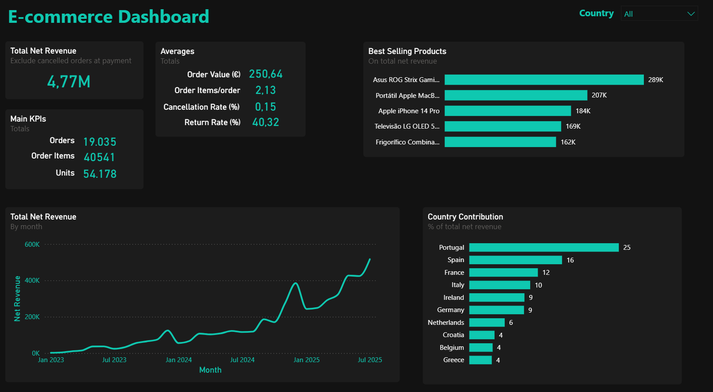

# 🛒 Ecommerce Database Project (MySQL 8.x)

## 🚀 Quick Summary

- Fully normalized MySQL 8 e-commerce database
- End-to-end analytics layer with KPIs, cohorts and LTV
- Secure, role-based access model
- Synthetic data generation with Python
- Power BI dashboard included

---

## **📌 Overview**

- This project implements a **relational e-commerce database** using **MySQL 8.0+**, designed as an **SQL analytics portfolio project**.
- It covers the end-to-end lifecycle of an e-commerce business, from transactional data modeling to analytical queries and KPIs.
- Although modeled as an e-commerce system, the techniques are **fully transferable** to domains such as **banking, telecom, SaaS, and healthcare**.

---

## **🎯 Objectives & Skills Demonstrated**

- This project demonstrates proficiency in:
  - Relational data modeling & normalization
  - Advanced SQL for analytics (CTEs, window functions, cohorts, KPIs)
  - Semantic layer design using views
  - Synthetic data generation (Python & CSV)
  - Security best practices (roles, least privilege access)

---

## Target Audience

- This project is designed as a portfolio project to demonstrate my skills for Data Analyst roles, showcasing strong proficiency in SQL, data modeling, and business-oriented analytics.

---

## **📊 Business Questions Answered**

- The analytical layer answers real-world business questions such as:
  - How is revenue evolving over time (MoM / YoY)?
  - Which products and categories generate the most value?
  - What are the Average Order Value (AOV) and basket size?
  - Who are the most valuable customers (LTV)?
  - What is the impact of refunds and payment failures?
  
- It showcases how raw transactional data can be transformed into **actionable business insights**.

---

## **📂 Project Structure**

```text
ecommerce_project/
├── .venv/
├── dashboards/
|   └── ecommerce_dashboard.pbix            
├── data/
│   ├── insert_data.sql               
│   ├── products.csv                  
│   └── python_scripts/               
|       ├── insert_customers.py       
│       ├── insert_orders.py          
│       ├── insert_order_items.py     
│       ├── insert_payments.py        
|       ├── insert_returns.py
|       └── reset_order_info.py
├── diagrams/
│   └── ER_diagram.png 
├── schema/
│   ├── check.sql
│   ├── create_schema.sql           
│   └── permissions.sql    
├── sql_analysis/
│   ├── 00_views.sql
│   ├── 01_basic_kpis.sql   
│   ├── 02_product_analysis.sql 
│   ├── 03_customer_analysis.sql         
│   └── 04_payment_analysis.sql 
├── validations/
│   └── scripts_validation.sql                        
├── .env
├── README.md
└── requirements.txt                       
```

---

## **🛠️ Technologies Used**

- **MySQL 8.0+** – relational database and analytics engine
- **Python 3.10+** – synthetic data generation and ETL
- **SQL** – analytics, KPIs, cohorts, and window functions
- **Power BI** – dashboards and visualization

---

## **🗄️ Database Design**

- Fully normalized schema with referential integrity
- Core tables:
  - `customers`, `products`, `orders`, `order_items`, `payments`, `product_returns`  
- Lookup tables:
  - `countries`, `product_categories`, `order_status`, `payment_methods`, `payment_status`, `return_reasons`  
- Includes:
  - Foreign keys and `CHECK` constraints  
  - Indexes optimized for analytical queries
  - Audit columns (`created_at`, `updated_at`)  


---

### **Core Tables**

- **customers**
  - Columns: customer_id, first_name, last_name, birth_date, city, country_id, created_at, updated_at
  - Populated by: python script (data/python_scripts/insert_customers.py)

- **products**
  - Columns: product_id, name, price, stock_quantity, category_id, created_at, updated_at
  - Populated by: csv import (data/products_csv)

- **orders**
  - Columns: order_id, customer_id, order_date, order_status_id, created_at, updated_at
  - Populated by: python script (data/python_scripts/insert_orders.py)

- **order_items**
  - Columns: order_item_id, order_id, product_id, quantity, unit_price
  - Populated by: python script (data/python_scripts/insert_order_items.py)

- **payments**
  - Columns: payment_id, order_id, attempt_no, payment_date, amount_paid, payment_method_id, payment_status_id, created_at, updated_at
  - Populated by: python script (data/python_scripts/insert_payments.py)

- **product_returns**
  - Columns: return_id, order_item_id, return_date, refund_amount, return_reason_id, created_at, updated_at
  - Populated by: python script (data/python_scripts/insert_returns.py)

---

### **Lookup tables**

- **countries**
  - Columns: country_id, name, iso_code
  - Populated by: sql script (data/insert_data.sql)

- **product_categories**
  - Columns: category_id, name
  - Populated by: sql script (data/insert_data.sql)

- **order_status**
  - Columns: order_status_id, code, name, sort_order, is_final
  - Populated by: sql script (data/insert_data.sql)

- **payment_methods**
  - Columns: payment_method_id, code, name
  - Populated by: sql script (data/insert_data.sql)

- **payment_status**
  - Columns: payment_status_id, code, name, is_final
  - Populated by: sql script (data/insert_data.sql)

- **return_reasons**
  - Columns: return_reason_id, code, name
  - Populated by: sql script (data/insert_data.sql)

---

## Data Flow Overview

Python → MySQL (OLTP) → Views (Semantic Layer) → SQL Analytics → Power BI

---

## Business Assumptions

-
-
-
-
-
-

---

## **🔑 Security & Permissions**

- Implements **least privilege access**  
- Defines a reusable `readonly` role with:
  - `SELECT`
  - `SHOW VIEW`
- Read-only users:
  - `data_analyst` – ad-hoc analysis  
  - `dashboard_app` – BI tools and dashboards  
- No real credentials are stored in the repository

---

## **👀 Semantic Layer (Views)**

- The semantic layer is implemented in 00_views.sql and standardizes business logic:
  - Order gross, refunded, and net amounts  
  - Paid/unpaid orders
  - Customer first-purchase identification  

```sql
SELECT c.first_name, c.last_name, t.net_amount, p.paid_amount
FROM customers c
JOIN orders o ON o.customer_id = c.customer_id
JOIN v_order_totals t ON t.order_id = o.order_id
JOIN v_order_payments p ON p.order_id = o.order_id;
```

---

## Dashboard Preview



---

## **📈 Analytical Queries & KPIs**

- All analytical queries are organized by business theme and consume the semantic views.

### **Business KPIs (`01_basic_kpis.sql`)**

- Net revenue and gross margin  
- Average Order Value (AOV)  
- Order volume and payment success rate  

### **Sales & Product Analysis (`02_product_analysis.sql`)**

- Revenue trends (MoM / YoY)  
- Top products and categories  
- Refund impact on revenue  

### **Customer Analysis (`03_customer_analysis.sql`)**

- New vs returning customers  
- Customer Lifetime Value (LTV)  
- Retention and cohort analysis  
- RFV-style customer segmentation  

### **Payment Analysis (`04_payment_analysis.sql`)**

- Payment method mix  
- Failure and retry rates  
- Time-to-payment metrics  

---

## **⚙️ How to Run (Windows)**

### 0. Requirements

- MySQL Server 8.0+
- Python 3.10+
- MySQL Workbench or mysql client on the command line
- An administrative MySQL account with privileges to:
  - GLOBAL: CREATE, (DROP if you want to drop DB), CREATE USER, CREATE ROLE, GRANT OPTION
  - ON ecommerce_db.*: ability to grant SELECT, SHOW VIEW to others

### 1. Clone the repository and enter the project

```bash
git clone https://github.com/JoaoLisboaDev/ecommerce_project.git
cd ecommerce_project
```

### 2. Virtual environment and dependencies

#### 2.1. Create the virtual environment

```bash
python -m venv .venv
```

- What it does: creates a project-local, isolated Python in the .venv/ folder.
- Expect: a new .venv folder appears in your project.
- Verify: .venv\Scripts\python.exe exists.

#### 2.2. Activate the virtual environment

```bash
.\.venv\Scripts\Activate.ps1
```

- What it does: “enters” the virtual environment.
- Expect: your prompt shows (.venv) at the beginning.
- Verify:

```bash
python --version
where python
```

- where python should point to ...\ecommerce_project\.venv\Scripts\python.exe.

#### 2.3. Install project dependencies

```bash
pip install -r requirements.txt
```

- What it does: installs all libraries listed in requirements.txt into the venv.
- Expect: installation logs ending with “Successfully installed …”.
- Verify:

```bash
pip list
```

- Should show the expected packages.
  
#### 2.4. (Optional) Confirm you’re using the venv’s pip

```bash
where pip
```

- Should point to ...\ecommerce_project\.venv\Scripts\pip.exe.

#### 2.5. Deactivate when you’re done

```bash
deactivate
```

- What it does: exits the venv and returns to the system Python.
- Expect: the (.venv) prefix disappears from your prompt.

### 3. Environment variables

- Create your .env from the example and fill the missing values (User and password)

```bash
copy .env.example .env
```

### 4. Create a database and schema

Run create_schema.sql

### 5. Create read-only users & permissions

Run permissions.sql

- Use an admin MySQL account (not necessarily root) that can CREATE USER, CREATE ROLE and GRANT.
- Edit placeholders in schema/permissions.sql before running:
  - HOST → usually localhost (use % only if you know you need remote access)
  - STRONG_PASSWORD_DATA_ANALYST / STRONG_PASSWORD_DASHBOARD_APP → set strong passwords

(Optional) Verify

```sql
SHOW GRANTS FOR 'data_analyst'@'localhost';
SHOW GRANTS FOR 'dashboard_app'@'localhost';
```

### 6. Populate reference data

```bash
mysql -u <user> -p < data/insert_data.sql
```

### 7. Import product data

- Import products.csv for the product catalog.

### 8. Generate transactional data

- Run the Python scripts in order:
  1. insert_customers.py
  2. insert_orders.py
  3. insert_order_items.py
  4. insert_payments.py
  5. insert_returns.py

---

## **💡 Business Value**

This project provides the foundation for a real-world analytics pipeline for an e-commerce platform. It can be used to:

- Identify top-performing products and categories
- Measure customer lifetime value (LTV)
- Optimize stock levels and reduce returns
- Monitor payment performance and revenue growth

---

## **📬 Author**

- João Lisboa

---
