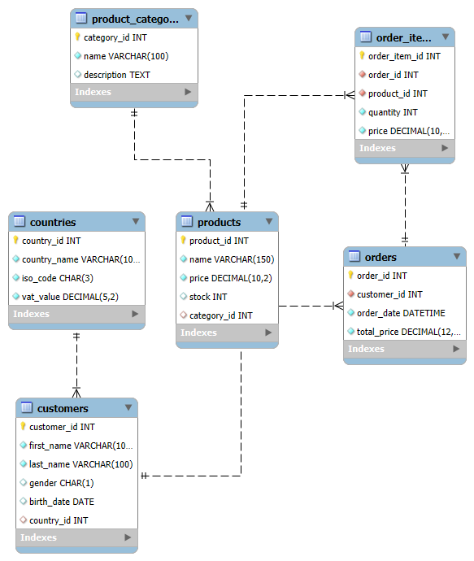

# 🛒 Ecommerce Database Project

## **📌 Description**

This project implements a relational database for an ecommerce system using **MySQL 8.0+**.  
The goal is to demonstrate skills in **data modeling**, **SQL for analytics**, and **security best practices**.

The project covers the full cycle of an e-commerce business:

- Customer, product, order, payment, and returns management
- Automatic generation and import of synthetic datasets
- Advanced SQL queries to produce KPIs and actionable business insights

## **📂 Project Structure**

```text
ecommerce_project/
├── .venv/                            
├── data/
│   ├── insert_data.sql               
│   ├── products.csv                  
│   └── python_scripts/               
|       ├── insert_customers.py       
│       ├── insert_orders.py          
│       ├── insert_order_items.py     
│       ├── insert_payments.py        
|       └── insert_returns.py
├── diagrams/
│   └── ER_diagram.png 
├── schema/
│   ├── create_schema.sql             
│   └── permissions.sql                           
├── .env
├── README.md
└── requirements.txt                       
```

## **🛠️ Requirements**

- MySQL 8.0+
- `root` user to run `permissions.sql`
- `data_analyst` user to execute analysis queries

## **🛠️ Technologies Used**

- MySQL – database and analytics engine
- Python – synthetic data generation and ETL
- CSV – product dataset import
- BI tools such as Power BI, Tableau, or Metabase can be connected for dashboards (TO DO)

## **⚙️ How to Run**

### 1. Clone the repository

```bash
   git clone https://github.com/<your-username>/commerce_sql_project.git
   cd ecommerce_project
```

## **🗄 Database Schema**

The database was designed using MySQL and follows best practices for normalization, referential integrity, and auditing.
Main tables:

- countries: Stores countries and VAT rates
- customers: Customer profile data
- products & product_category: Product catalog and categorization
- orders: Customer orders and their status
- order_items: Items purchased in each order
- payments: Payment details and methods
- returns: Returns and refund details



## 🗄️ 1. Database Schema (`schema.sql`)

- Creates the `ecommerce_db` database with **UTF-8 charset**.  
- Structure divided into:
  - **Lookups**: `countries`, `product_categories`, `order_status`, `payment_methods`, `payment_status`, `return_reasons`.  
  - **Core entities**: `customers`, `products`, `orders`, `order_items`, `payments`, `product_returns`.  
- Features:
  - **Integrity constraints** (`CHECK`, `FOREIGN KEY`).  
  - **Optimized indexes** for frequent queries (by customer, date, product).  
  - **Automatic timestamps** for auditing (`created_at`, `updated_at`).  

---

## 🔑 2. Permissions (`permissions.sql`)

- Implements **least privilege access**:
  - Creates a `readonly` role with `SELECT` and `SHOW VIEW`.  
  - User `data_analyst` (for manual queries).  
  - User `dashboard_app` (for BI tools connection).  
- **Placeholders**:
  - `<HOST>` → use `'localhost'` for local access or `'%'` for remote access (only on controlled networks).  
  - `<STRONG_PASSWORD_…>` → replace with strong, unique passwords before running.  
- Safe for GitHub: no real credentials stored.  

---

## 👀 3. Analytical Views (`views.sql`)

- **`v_order_totals`** → gross, refunded, and net amount per order.  
- **`v_order_payments`** → total paid and payment dates per order.  
- Example query:
  
```sql
SELECT c.first_name, c.last_name, t.net_amount, p.paid_amount
FROM customers c
JOIN orders o ON o.customer_id = c.customer_id
JOIN v_order_totals t ON t.order_id = o.order_id
JOIN v_order_payments p ON p.order_id = o.order_id;
```

## **📊 Data Generation**

Data is generated using two approaches:

- Python scripts (located in python_scripts/): generate synthetic data for customers, orders, order_items, payments and returns.
- CSV import: the products table is populated using products.csv via the MySQL import process.

## **🔎 Analyses and KPIs**

The analysis/ folder contains multiple SQL scripts focused on generating business insights. Examples include:

### **1. Sales Analysis**

- Monthly revenue growth per country and product category
- Top-selling products and product profitability
- Average order value and basket size

### **2. Customer Analysis**

- New vs returning customers (cohort analysis)
- Lifetime Value (LTV) and churn risk
- Customer segmentation by spending and frequency

### **3. Product & Stock Analysis**

- Stock turnover and out-of-stock risk
- Returns ratio per product/category
- Contribution margin per product

### **4. Global KPIs**

- Net revenue, gross margin, and return rate
- Payment failure rate by method
- On-time vs delayed delivery (if shipping data available)

1. **Create the database and tables**

```bash
mysql -u <user> -p < schema/create_schema.sql
```

1. **Generate and import data**

   - Run Python scripts to generate dataset.
   - Import product CSV and other generated data.

1. **Create the reusable views (atomic metrics)**
   - These views contain core aggregated metrics (e.g., orders by country, revenue by country, monthly sales) and are used in multiple analysis scripts.

```bash
mysql -u <user> -p < views/create_views.sql
```

1. **Run the analysis queries**
   - Open any file in analysis/ and execute the queries in MySQL Workbench, DBeaver, or command line.

```bash
mysql -u <user> -p < analysis/sales_analysis.sql
mysql -u <user> -p < analysis/customers_analysis.sql
mysql -u <user> -p < analysis/products_analysis.sql
mysql -u <user> -p < analysis/business_kpis.sql
```

## **💡 Business Value**

This project provides the foundation for a real-world analytics pipeline for an e-commerce platform. It can be used to:

- Identify top-performing products and categories
- Measure customer lifetime value (LTV)
- Optimize stock levels and reduce returns
- Monitor payment performance and revenue growth

## **📬 Contact**

If you have any questions or suggestions, feel free to connect:
📧 <your.email@example.com>
[LinkedIn](https://www.linkedin.com/in/your-profile)

TO DO

1️⃣ Qual é o risco de ter demasiada informação?
Recrutadores ou hiring managers podem não ter tempo para ler 4 ficheiros longos.

Se virem um SQL gigante sem contexto, podem achar “overkill” e não entender o valor.

O que querem ver é clareza, profissionalismo e capacidade de gerar insights, não só volume de queries.

2️⃣ Como resolver isso? (O segredo é o README e o storytelling)
A tua base de dados e scripts são um arsenal poderoso, mas deves:

Resumir as análises no README:

Colocar apenas 4–5 highlights (“KPIs principais que este projeto analisa”).

Mostrar exemplos (pequenos) de queries e outputs.

Mostrar prints: gráficos e tabelas com resultados-chave.

1 gráfico de evolução de receita

1 tabela com top clientes/produtos

1 KPI de devoluções e stock

Organizar scripts por tema (já está) e indicar no README:

“Quer ver detalhes de vendas? Abra sales_analysis.sql”

“Quer ver KPIs executivos? Veja business_kpis.sql”

Assim quem for analisar sabe onde clicar, e não se sente perdido.

3️⃣ Porque vale a pena ter detalhe (mesmo que não leiam tudo)
Mostra que sabes documentar e trabalhar como num ambiente real.

Se alguém mais técnico abrir, vai ver qualidade: CTEs, parâmetros, métricas bem definidas.

Tens material para usar nas entrevistas (explicar como construíste cada KPI).

4️⃣ Estratégia final
README é a vitrine: resumo + prints bonitos + links para os scripts.

Os scripts completos ficam como prova de profundidade técnica.

Se quiseres, podes até criar versões resumidas: um highlight_kpis.sql com apenas 4–5 queries de impacto.

NOVO

## E-commerce SQL Project (MySQL 8.x)

This portfolio project demonstrates SQL analyst skills on a realistic e-commerce dataset.
It uses MySQL 8 with CTEs, window functions, robust joins, and data-quality checks.

## Structure

- create_views.sql -> the semantic layer (enriched views for customers, orders, items, payments, refunds, KPIs, cohorts, AR).
- business_kpis.sql -> daily revenue, margin, AOV by country, YoY growth, payment mix, data-quality checks.
- sales_analysis.sql -> sales trends, 7-day averages, category mix, refund impact, basket analysis.
- product_analysis.sql -> top sellers, refund impact, category contribution, recent trends, low performers, price vs sales.
- customer_analyses.sql -> new vs returning, lifetime value, churn snapshot, retention cohorts, RFV segmentation, AR.

## How it fits together

- Views (create_views.sql) standardize calculations (VAT, refunds, “fully paid”) and preserve data quality.
- Analysis files consume those views, showing business insights while highlighting SQL techniques:
  - CTEs for first-purchase logic
  - Window functions for cohorts, RFV, rolling averages
  - Safe ratios with NULLIF
  - Anti-joins for orphan/unsold checks

## Transferability

Although framed as e-commerce (customers, orders, payments), the techniques generalize to banking transactions, telecom events, SaaS usage, or healthcare encounters.

## SQL Portfolio - E-commerce Project

This project demonstrates SQL analyst skills in MySQL 8 using a realistic e-commerce dataset.
It includes a views layer (create_views.sql) that standardizes calculations (orders, items, payments, refunds, KPIs, cohorts).
On top of that, focused analyses cover Business KPIs, Sales, Products, and Customers.
Key techniques shown: CTEs, window functions, safe ratios, rolling averages, cohorts, RFM, data quality checks.
Although modeled as e-commerce, the methods are transferable to banking, telecom, SaaS, and healthcare.

## 🔒 Security Notes

- For production environments, it is recommended to:
  - Apply password policies (PASSWORD EXPIRE, FAILED_LOGIN_ATTEMPTS, PASSWORD_LOCK_TIME).
  - Restrict host access ('localhost' or specific IP instead of '%').
  - Manage credentials via a secret manager (not versioned files).

## Run

### Environment setup (terminal)

1. Clone this repository -> `git clone https://github.com/teuuser/ecommerce_sql_project.git`

2. Change to this directory -> `cd ecommerce_sql_project`

3. Create a virtual environment (recommended) on the project folder -> `python -m venv .venv`

4. Activate the virtual environment -> `.venv\Scripts\activate`

5. Install the dependencies -> `pip install -r requirements.txt`

6. Make sure VS Code is using this environment -> `ecommerce_sql_project/.venv/Scripts/python.exe`

### Database table creation

### Test database (ecommerce_db_test)

| product_id | price  | category_id | name         |
|-------------|--------|-------------|---------------|
| 1           | 100.00 | 1           | Electronics   |
| 2           | 15.00  | 2           | Fashion       |
| 3           | 50.00  | 1           | Electronics   |

| category_id | name           |
|:------------:|:---------------|
| 1            | Electronics    |
| 2            | Fashion        |
| 3            | Home & Kitchen |

| customer_id | first_name | last_name | birth_date | city   | country_id | created_at          | updated_at          |
|:------------:|:-----------|:-----------|:------------|:--------|:------------:|:--------------------|:--------------------|
| 1 | Antonio | Macias | 1972-09-27 | Madrid | 2 | 2023-12-13 17:53:58 | 2025-10-03 20:24:13 |
| 2 | Lúcia | Batista | 1986-03-21 | Porto | 1 | 2023-05-16 01:18:52 | 2025-10-03 20:24:13 |
| 3 | Artur | Vicente | 1999-03-17 | Lisboa | 1 | 2023-12-28 10:13:36 | 2025-10-03 20:24:13 |

| order_id | customer_id | order_date          | order_status_id | created_at          | updated_at          |
|:---------:|:------------:|:--------------------|:----------------:|:--------------------|:--------------------|
| 1 | 3 | 2023-03-30 15:26:35 | 4 | 2023-03-30 15:26:35 | 2023-03-30 15:26:35 |
| 2 | 2 | 2024-07-30 06:24:58 | 4 | 2024-07-30 06:24:58 | 2024-07-30 06:24:58 |
| 3 | 1 | 2024-12-29 05:02:52 | 4 | 2024-12-29 05:02:52 | 2024-12-29 05:02:52 |
| 4 | 1 | 2025-03-23 03:22:15 | 4 | 2025-03-23 03:22:15 | 2025-03-23 03:22:15 |

| order_item_id | order_id | product_id | quantity | unit_price |
|:--------------:|:---------:|:-----------:|:----------:|:-----------:|
| 1 | 1 | 1 | 1 | 100.00 |
| 2 | 1 | 3 | 3 | 50.00 |
| 3 | 1 | 2 | 1 | 15.00 |
| 4 | 2 | 3 | 1 | 50.00 |
| 5 | 2 | 2 | 1 | 15.00 |
| 6 | 2 | 1 | 1 | 100.00 |
| 7 | 3 | 1 | 2 | 100.00 |
| 8 | 4 | 2 | 2 | 15.00 |

| ID | Código          | Método de Pagamento     |
|----|------------------|--------------------------|
| 1  | card             | Credit/debit card        |
| 2  | paypal           | PayPal                   |
| 3  | mbway            | MB Way                   |
| 4  | bank_transfer    | Bank transfer            |

->>> Ordem de execução

- Run schema.sql
- Run insert_customers.py
- Run insert_orders.py
